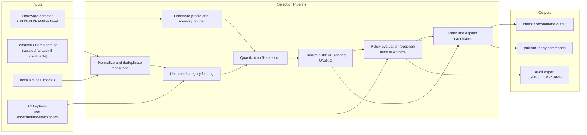

<p align="center">
  
</p>

<p align="center">
  <h1 align="center">LLM Checker</h1>
  <p align="center">
    <strong>Intelligent Ollama Model Selector</strong>
  </p>
  <p align="center">
    AI-powered CLI that analyzes your hardware and recommends optimal LLM models<br/>
    Deterministic scoring across <b>200+ dynamic models</b> (35+ curated fallback) with hardware-calibrated memory estimation
  </p>
</p>

<p align="center">
  <a href="https://www.npmjs.com/package/llm-checker"></a>
  <a href="https://www.npmjs.com/package/llm-checker"></a>
  <a href="https://opensource.org/licenses/MIT"></a>
  <a href="https://discord.gg/mnmYrA7T"></a>
  <a href="https://nodejs.org/"></a>
</p>

<p align="center">
  <a href="#installation">Installation</a> &bull;
  <a href="#quick-start">Quick Start</a> &bull;
  <a href="#claude-code-mcp">Claude MCP</a> &bull;
  <a href="#commands">Commands</a> &bull;
  <a href="#scoring-system">Scoring</a> &bull;
  <a href="#supported-hardware">Hardware</a> &bull;
  <a href="https://discord.gg/mnmYrA7T"> Discord</a>
</p>

---

## Why LLM Checker?

Choosing the right LLM for your hardware is complex. With thousands of model variants, quantization levels, and hardware configurations, finding the optimal model requires understanding memory bandwidth, VRAM limits, and performance characteristics.

**LLM Checker solves this.** It analyzes your system, scores every compatible model across four dimensions (Quality, Speed, Fit, Context), and delivers actionable recommendations in seconds.

---

## Features

| | Feature | Description |
|:---:|---|---|
| **200+** | Dynamic Model Pool | Uses full scraped Ollama catalog/variants when available (with curated fallback) |
| **4D** | Scoring Engine | Quality, Speed, Fit, Context &mdash; weighted by use case |
| **Multi-GPU** | Hardware Detection | Apple Silicon, NVIDIA CUDA, AMD ROCm, Intel Arc, CPU |
| **Calibrated** | Memory Estimation | Bytes-per-parameter formula validated against real Ollama sizes |
| **Zero** | Native Dependencies | Pure JavaScript &mdash; works on any Node.js 16+ system |
| **Optional** | SQLite Search | Install `sql.js` to unlock `sync`, `search`, and `smart-recommend` |

---

## Comparison with Other Tooling (e.g. `llmfit`)

LLM Checker and `llmfit` solve related but different problems:

| Tool | Primary Focus | Typical Output |
|------|---------------|----------------|
| **LLM Checker** | Hardware-aware **model selection** for local inference | Ranked recommendations, compatibility scores, pull/run commands |
| **llmfit** | LLM workflow support and model-fit evaluation from another angle | Different optimization workflow and selection heuristics |

If your goal is: *"What should I run on this exact machine right now?"*, use **LLM Checker** first.  
If your goal is broader experimentation across custom pipelines, using both tools can be complementary.

---

## Installation

```bash
# Install globally
npm install -g llm-checker

# Or run directly with npx
npx llm-checker hw-detect
```

**Requirements:**
- Node.js 16+ (any version: 16, 18, 20, 22, 24)
- [Ollama](https://ollama.ai) installed for running models

**Optional:** For database search features (`sync`, `search`, `smart-recommend`):
```bash
npm install sql.js
```

---

## Distribution

LLM Checker is published in all primary channels:

- npm (latest): [`llm-checker@3.2.4`](https://www.npmjs.com/package/llm-checker)
- GitHub Release: [`v3.2.4`](https://github.com/Pavelevich/llm-checker/releases/tag/v3.2.4)
- GitHub Packages: [`@pavelevich/llm-checker`](https://github.com/users/Pavelevich/packages/npm/package/llm-checker)

### v3.2.4 Highlights

- Fixed `recommend` hardware-profile handling so discrete VRAM limits are honored consistently.
- Added deterministic selector regression coverage for 24GB VRAM fit behavior.

### Optional: Install from GitHub Packages

```bash
# 1) Configure registry + token (PAT with read:packages)
echo "@pavelevich:registry=https://npm.pkg.github.com" >> ~/.npmrc
echo "//npm.pkg.github.com/:_authToken=${GITHUB_TOKEN}" >> ~/.npmrc

# 2) Install
npm install -g @pavelevich/llm-checker@3.2.4
```

---

## Quick Start

```bash
# 1. Detect your hardware capabilities
llm-checker hw-detect

# 2. Get full analysis with compatible models
llm-checker check

# 3. Get intelligent recommendations by category
llm-checker recommend

# 4. (Optional) Sync full database and search
llm-checker sync
llm-checker search qwen --use-case coding
```

---

## Claude Code MCP

LLM Checker includes a built-in [Model Context Protocol](https://modelcontextprotocol.io/) (MCP) server, allowing **Claude Code** and other MCP-compatible AI assistants to analyze your hardware and manage local models directly.

### Setup (One Command)

```bash
# Install globally first
npm install -g llm-checker

# Add to Claude Code
claude mcp add llm-checker -- llm-checker-mcp
```

Or with npx (no global install needed):

```bash
claude mcp add llm-checker -- npx llm-checker-mcp
```

Restart Claude Code and you're done.

### Available MCP Tools

Once connected, Claude can use these tools:

**Core Analysis:**

| Tool | Description |
|------|-------------|
| `hw_detect` | Detect your hardware (CPU, GPU, RAM, acceleration backend) |
| `check` | Full compatibility analysis with all models ranked by score |
| `recommend` | Top model picks by category (coding, reasoning, multimodal, etc.) |
| `installed` | Rank your already-downloaded Ollama models |
| `search` | Search the Ollama model catalog with filters |
| `smart_recommend` | Advanced recommendations using the full scoring engine |

**Ollama Management:**

| Tool | Description |
|------|-------------|
| `ollama_list` | List all downloaded models with params, quant, family, and size |
| `ollama_pull` | Download a model from the Ollama registry |
| `ollama_run` | Run a prompt against a local model (with tok/s metrics) |
| `ollama_remove` | Delete a model to free disk space |

**Advanced (MCP-exclusive):**

| Tool | Description |
|------|-------------|
| `ollama_optimize` | Generate optimal Ollama env vars for your hardware (NUM_GPU, PARALLEL, FLASH_ATTENTION, etc.) |
| `benchmark` | Benchmark a model with 3 standardized prompts — measures tok/s, load time, prompt eval |
| `compare_models` | Head-to-head comparison of two models on the same prompt with speed + response side-by-side |
| `cleanup_models` | Analyze installed models — find redundancies, cloud-only models, oversized models, and upgrade candidates |
| `project_recommend` | Scan a project directory (languages, frameworks, size) and recommend the best model for that codebase |
| `ollama_monitor` | Real-time system status: RAM usage, loaded models, memory headroom analysis |

### Example Prompts

After setup, you can ask Claude things like:

- *"What's the best coding model for my hardware?"*
- *"Benchmark qwen2.5-coder and show me the tok/s"*
- *"Compare llama3.2 vs codellama for coding tasks"*
- *"Clean up my Ollama — what should I remove?"*
- *"What model should I use for this Rust project?"*
- *"Optimize my Ollama config for maximum performance"*
- *"How much RAM is Ollama using right now?"*

Claude will automatically call the right tools and give you actionable results.

---

## Commands

### Core Commands

| Command | Description |
|---------|-------------|
| `hw-detect` | Detect GPU/CPU capabilities, memory, backends |
| `check` | Full system analysis with compatible models and recommendations |
| `recommend` | Intelligent recommendations by category (coding, reasoning, multimodal, etc.) |
| `installed` | Rank your installed Ollama models by compatibility |

### Advanced Commands (require `sql.js`)

| Command | Description |
|---------|-------------|
| `sync` | Download the latest model catalog from Ollama registry |
| `search <query>` | Search models with filters and intelligent scoring |
| `smart-recommend` | Advanced recommendations using the full scoring engine |

### Enterprise Policy Commands

| Command | Description |
|---------|-------------|
| `policy init` | Generate a `policy.yaml` template for enterprise governance |
| `policy validate` | Validate a policy file and return non-zero on schema errors |
| `audit export` | Evaluate policy outcomes and export compliance reports (`json`, `csv`, `sarif`) |

### Policy Enforcement in `check` and `recommend`

Both `check` and `recommend` support `--policy <file>`.

- In `audit` mode, policy violations are reported but the command exits with `0`.
- In `enforce` mode, blocking violations return non-zero (default `1`).
- You can override the non-zero code with `enforcement.exit_code` in `policy.yaml`.

Examples:

```bash
llm-checker check --policy ./policy.yaml
llm-checker check --policy ./policy.yaml --use-case coding --runtime vllm
llm-checker recommend --policy ./policy.yaml --category coding
```

### Policy Audit Export

Use `audit export` when you need machine-readable compliance evidence for CI/CD gates, governance reviews, or security tooling.

```bash
# Single report format
llm-checker audit export --policy ./policy.yaml --command check --format json --out ./reports/check-policy.json

# Export all configured formats (json, csv, sarif)
llm-checker audit export --policy ./policy.yaml --command check --format all --out-dir ./reports
```

- `--command check|recommend` chooses the candidate source.
- `--format all` honors `reporting.formats` in your policy (falls back to `json,csv,sarif`).
- In `enforce` mode with blocking violations, reports are still written before non-zero exit.

### Integration Examples (SIEM / CI Artifacts)

```bash
# CI artifact (JSON) for post-processing in pipeline jobs
llm-checker audit export --policy ./policy.yaml --command check --format json --out ./reports/policy-report.json

# Flat CSV for SIEM ingestion (Splunk/ELK/DataDog pipelines)
llm-checker audit export --policy ./policy.yaml --command check --format csv --out ./reports/policy-report.csv

# SARIF for security/code-scanning tooling integrations
llm-checker audit export --policy ./policy.yaml --command check --format sarif --out ./reports/policy-report.sarif
```

### GitHub Actions Policy Gate (Copy-Paste)

```yaml
name: Policy Gate
on: [pull_request]

jobs:
  policy-gate:
    runs-on: ubuntu-latest
    steps:
      - uses: actions/checkout@v4
      - uses: actions/setup-node@v4
        with:
          node-version: 20
      - run: npm ci
      - run: node bin/enhanced_cli.js check --policy ./policy.yaml --runtime ollama --no-verbose
      - if: always()
        run: node bin/enhanced_cli.js audit export --policy ./policy.yaml --command check --format all --runtime ollama --no-verbose --out-dir ./policy-reports
      - if: always()
        uses: actions/upload-artifact@v4
        with:
          name: policy-audit-reports
          path: ./policy-reports
```

### Provenance Fields in Reports

`check`, `recommend`, and `audit export` outputs include normalized model provenance fields:

- `source`
- `registry`
- `version`
- `license`
- `digest`

If a field is unavailable from model metadata, outputs use `"unknown"` instead of omitting the field. This keeps downstream parsers deterministic.
License values are canonicalized for policy checks (for example `MIT License` -> `mit`, `Apache 2.0` -> `apache-2.0`).

### AI Commands

| Command | Description |
|---------|-------------|
| `ai-check` | AI-powered model evaluation with meta-analysis |
| `ai-run` | AI-powered model selection and execution |

---

### `hw-detect` &mdash; Hardware Analysis

```bash
llm-checker hw-detect
```

```
Summary:
  Apple M4 Pro (24GB Unified Memory)
  Tier: MEDIUM HIGH
  Max model size: 15GB
  Best backend: metal

CPU:
  Apple M4 Pro
  Cores: 12 (12 physical)
  SIMD: NEON

Metal:
  GPU Cores: 16
  Unified Memory: 24GB
  Memory Bandwidth: 273GB/s
```

### `recommend` &mdash; Category Recommendations

```bash
llm-checker recommend
```

```
INTELLIGENT RECOMMENDATIONS BY CATEGORY
Hardware Tier: HIGH | Models Analyzed: 205

Coding:
   qwen2.5-coder:14b (14B)
   Score: 78/100
   Command: ollama pull qwen2.5-coder:14b

Reasoning:
   deepseek-r1:14b (14B)
   Score: 86/100
   Command: ollama pull deepseek-r1:14b

Multimodal:
   llama3.2-vision:11b (11B)
   Score: 83/100
   Command: ollama pull llama3.2-vision:11b
```

### `search` &mdash; Model Search

```bash
llm-checker search llama -l 5
llm-checker search coding --use-case coding
llm-checker search qwen --quant Q4_K_M --max-size 8
```

| Option | Description |
|--------|-------------|
| `-l, --limit <n>` | Number of results (default: 10) |
| `-u, --use-case <type>` | Optimize for: `general`, `coding`, `chat`, `reasoning`, `creative`, `fast` |
| `--max-size <gb>` | Maximum model size in GB |
| `--quant <type>` | Filter by quantization: `Q4_K_M`, `Q8_0`, `FP16`, etc. |
| `--family <name>` | Filter by model family |

---

## Model Catalog

LLM Checker prioritizes the full scraped Ollama model cache (all families/sizes/variants) and falls back to a built-in curated catalog when cache is unavailable.

The curated fallback catalog includes 35+ models from the most popular Ollama families (used only when the dynamic scraped pool is unavailable):

| Family | Models | Best For |
|--------|--------|----------|
| **Qwen 2.5/3** | 7B, 14B, Coder 7B/14B/32B, VL 3B/7B | Coding, general, vision |
| **Llama 3.x** | 1B, 3B, 8B, Vision 11B | General, chat, multimodal |
| **DeepSeek** | R1 8B/14B/32B, Coder V2 16B | Reasoning, coding |
| **Phi-4** | 14B | Reasoning, math |
| **Gemma 2** | 2B, 9B | General, efficient |
| **Mistral** | 7B, Nemo 12B | Creative, chat |
| **CodeLlama** | 7B, 13B | Coding |
| **LLaVA** | 7B, 13B | Vision |
| **Embeddings** | nomic-embed-text, mxbai-embed-large, bge-m3, all-minilm | RAG, search |

All available models are automatically combined with locally installed Ollama models for scoring.

---

## Scoring System

Models are evaluated across four dimensions, weighted by use case:

| Dimension | Description |
|-----------|-------------|
| **Q** Quality | Model family reputation + parameter count + quantization penalty |
| **S** Speed | Estimated tokens/sec based on hardware backend and model size |
| **F** Fit | Memory utilization efficiency (how well it fits in available RAM) |
| **C** Context | Context window capability vs. target context length |

### Scoring Weights by Use Case

Three scoring systems are available, each optimized for different workflows:

**Deterministic Selector** (primary &mdash; used by `check` and `recommend`):

| Category | Quality | Speed | Fit | Context |
|----------|:-------:|:-----:|:---:|:-------:|
| `general` | 45% | 35% | 15% | 5% |
| `coding` | 55% | 20% | 15% | 10% |
| `reasoning` | 60% | 10% | 20% | 10% |
| `multimodal` | 50% | 15% | 20% | 15% |

**Scoring Engine** (used by `smart-recommend` and `search`):

| Use Case | Quality | Speed | Fit | Context |
|----------|:-------:|:-----:|:---:|:-------:|
| `general` | 40% | 35% | 15% | 10% |
| `coding` | 55% | 20% | 15% | 10% |
| `reasoning` | 60% | 15% | 10% | 15% |
| `chat` | 40% | 40% | 15% | 5% |
| `fast` | 25% | 55% | 15% | 5% |
| `quality` | 65% | 10% | 15% | 10% |

All weights are centralized in `src/models/scoring-config.js`.

### Memory Estimation

Memory requirements are calculated using calibrated bytes-per-parameter values:

| Quantization | Bytes/Param | 7B Model | 14B Model | 32B Model |
|:------------:|:-----------:|:--------:|:---------:|:---------:|
| Q8_0 | 1.05 | ~8 GB | ~16 GB | ~35 GB |
| Q4_K_M | 0.58 | ~5 GB | ~9 GB | ~20 GB |
| Q3_K | 0.48 | ~4 GB | ~8 GB | ~17 GB |

The selector automatically picks the best quantization that fits your available memory.

---

## Supported Hardware

<details>
<summary><strong>Apple Silicon</strong></summary>

- M1, M1 Pro, M1 Max, M1 Ultra
- M2, M2 Pro, M2 Max, M2 Ultra
- M3, M3 Pro, M3 Max
- M4, M4 Pro, M4 Max

</details>

<details>
<summary><strong>NVIDIA (CUDA)</strong></summary>

- RTX 50 Series (5090, 5080, 5070 Ti, 5070)
- RTX 40 Series (4090, 4080, 4070 Ti, 4070, 4060 Ti, 4060)
- RTX 30 Series (3090 Ti, 3090, 3080 Ti, 3080, 3070 Ti, 3070, 3060 Ti, 3060)
- Data Center (H100, A100, A10, L40, T4)

</details>

<details>
<summary><strong>AMD (ROCm)</strong></summary>

- RX 7900 XTX, 7900 XT, 7800 XT, 7700 XT
- RX 6900 XT, 6800 XT, 6800
- Instinct MI300X, MI300A, MI250X, MI210

</details>

<details>
<summary><strong>Intel</strong></summary>

- Arc A770, A750, A580, A380
- Integrated Iris Xe, UHD Graphics

</details>

<details>
<summary><strong>CPU Backends</strong></summary>

- AVX-512 + AMX (Intel Sapphire Rapids, Emerald Rapids)
- AVX-512 (Intel Ice Lake+, AMD Zen 4)
- AVX2 (Most modern x86 CPUs)
- ARM NEON (Apple Silicon, AWS Graviton, Ampere Altra)

</details>

---

## Architecture

LLM Checker uses a deterministic pipeline so the same inputs produce the same ranked output, with explicit policy outcomes for governance workflows.



### Component Responsibilities

- **Input layer**: Collects runtime constraints from hardware detection, local inventory, dynamic registry data, and CLI flags.
- **Normalization layer**: Deduplicates identifiers/tags and builds a canonical candidate set.
- **Selection layer**: Filters by use case, selects the best fitting quantization, and computes deterministic Q/S/F/C scores.
- **Governance layer**: Applies policy rules in `audit` or `enforce` mode and records explicit violation metadata.
- **Output layer**: Returns ranked recommendations plus machine-readable compliance artifacts when requested.

### Execution Stages

1. **Hardware profiling**: Detect CPU/GPU/RAM and effective backend capabilities.
2. **Model pool assembly**: Merge dynamic scraped catalog (or curated fallback) with locally installed models.
3. **Candidate filtering**: Keep only relevant models for the requested use case.
4. **Fit selection**: Choose the best quantization for available memory budget.
5. **Deterministic scoring**: Score each candidate across quality, speed, fit, and context.
6. **Policy + ranking**: Apply optional policy checks, then rank and return actionable commands.

---

## Examples

**Detect your hardware:**
```bash
llm-checker hw-detect
```

**Get recommendations for all categories:**
```bash
llm-checker recommend
```

**Full system analysis with compatible models:**
```bash
llm-checker check
```

**Find the best coding model:**
```bash
llm-checker recommend --category coding
```

**Search for small, fast models under 5GB:**
```bash
llm-checker search "7b" --max-size 5 --use-case fast
```

**Get high-quality reasoning models:**
```bash
llm-checker smart-recommend --use-case reasoning
```

---

## Development

```bash
git clone https://github.com/Pavelevich/llm-checker.git
cd llm-checker
npm install
node bin/enhanced_cli.js hw-detect
```

### Project Structure

```
src/
  models/
    deterministic-selector.js  # Primary selection algorithm
    scoring-config.js          # Centralized scoring weights
    scoring-engine.js          # Advanced scoring (smart-recommend)
    catalog.json               # Curated fallback catalog (35+ models, only if dynamic pool unavailable)
  ai/
    multi-objective-selector.js  # Multi-objective optimization
    ai-check-selector.js        # LLM-based evaluation
  hardware/
    detector.js                # Hardware detection
    unified-detector.js        # Cross-platform detection
  data/
    model-database.js          # SQLite storage (optional)
    sync-manager.js            # Database sync from Ollama registry
bin/
  enhanced_cli.js              # CLI entry point
```

---

## License

MIT License &mdash; see [LICENSE](LICENSE) for details.

---

<p align="center">
  <a href="https://github.com/Pavelevich/llm-checker">GitHub</a> &bull;
  <a href="https://github.com/Pavelevich/llm-checker/releases">Releases</a> &bull;
  <a href="https://www.npmjs.com/package/llm-checker">npm</a> &bull;
  <a href="https://github.com/users/Pavelevich/packages/npm/package/llm-checker">GitHub Packages</a> &bull;
  <a href="https://github.com/Pavelevich/llm-checker/issues">Issues</a> &bull;
  <a href="https://discord.gg/mnmYrA7T">Discord</a>
</p>
